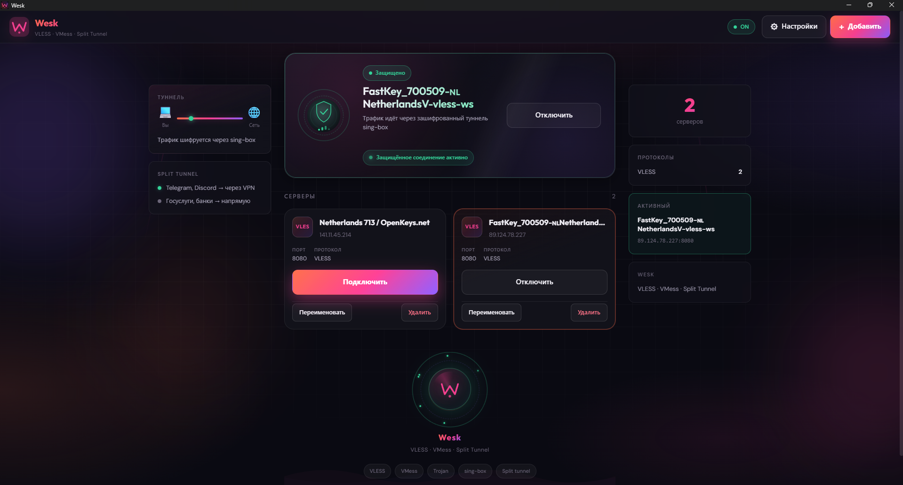

# Загрузка Wesk на GitHub

Идентификатор приложения: `com.neonclick.vpnconfigurator`

## 1. Собрать папку для репозитория

```powershell
npm run prepare:github
```

Скрипт создаст **`wesk-vpn-github/`** — чистый VPN-клиент (React + Tauri + Rust), без магазина, `node_modules`, сборок и `sing-box.exe`.

## 2. Создать репозиторий

1. Откройте [github.com/new](https://github.com/new)
2. Имя, например: `wesk-vpn`
3. **Не** добавляйте README/license при создании, если заливаете файлы вручную — они уже есть в папке

## 3. Загрузить файлы

### Без Git (проще)

1. В репозитории: **Add file → Upload files**
2. Перетащите **всё содержимое** папки `wesk-vpn-github` (не саму папку целиком, а файлы внутри)
3. Commit

### С Git

```powershell
cd wesk-vpn-github
git init
git add .
git commit -m "Initial commit: Wesk VPN client"
git branch -M main
git remote add origin https://github.com/ВАШ_ЛОГИН/wesk-vpn.git
git push -u origin main
```

## Что в репозитории

| Путь | Описание |
|------|----------|
| `src/` | React UI (hero, профили, split tunnel, анимации) |
| `src-tauri/` | Rust + Tauri 2 |
| `scripts/` | `kill-dev-ports.mjs`, `prepare-github.ps1` |
| `README.md` | Описание проекта |
| `LICENSE` | MIT |
| `package.json` | `npm run tauri:dev`, `tauri:build` |

## Что не попадает

| Исключено | Почему |
|-----------|--------|
| `node_modules/` | `npm install` после клонирования |
| `src-tauri/target/` | Сборка Rust |
| `src-tauri/binaries/*.exe` | sing-box скачивается отдельно |
| `.env` | Секреты |
| `frontend/`, `backend/`, `bot/`, `src/app/` | Другие проекты в монорепо |

## После клонирования

```bash
npm install
# sing-box → src-tauri/binaries/ (см. src-tauri/binaries/README.md)
npm run tauri:dev
```

На Windows для TUN запускайте терминал **от администратора**.

## Скриншот в README

Положите `screenshot.png` в корень репозитория и в `README.md`:

```markdown

```
